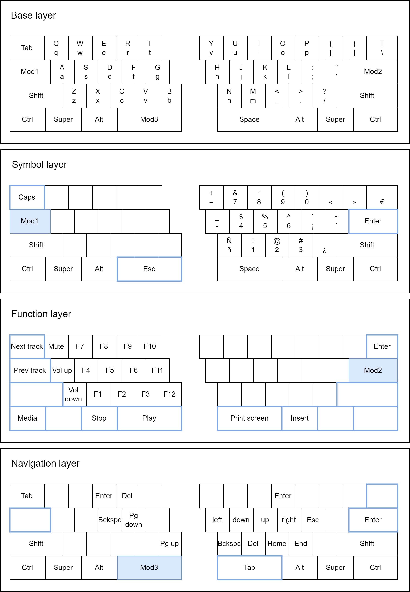

# p-layers

Keyboard layout that brings further-away keys closer to the home row. It is best suited for ANSI layouts with two spacebars as they can be found in split keyboards, although it should be adaptable to any other base layout easily.
For normal, single-spacebar keyboards, you would use this key as modifier (long press) and also regular spacebar (short, normal press).

At the moment it is based on the standard QWERTY ANSI layout and includes shortcuts for writing Spanish characters, such as "ñ". 
I use it with the US international keymap with dead keys on a YMDK 75% SP84 split keyboard.

    

The idea is similar to that of [Extend](https://dreymar.colemak.org/layers-extend.html).

## Usage

*TODO*
